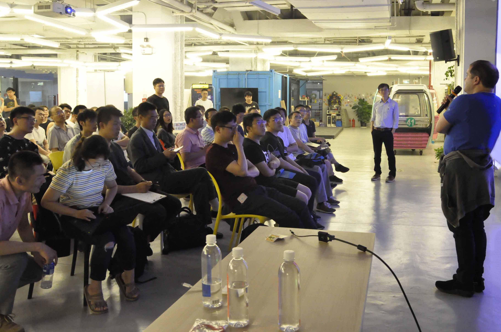

# 「活动回顾 」Googler大咖: Federated Learning与TensorFlow Lite介绍

## 引言
上周五，我们的「Googler大咖: Federated Learning与TensorFlow Lite介绍」分享活动圆满的结束了，虽然是在工作日，但是大家参与的热情依旧很高，总共有100名参会者报名成功，现场到场80多人。
## 活动回顾

 
 
等待开场

 

        
    
志愿者发放礼品

首先，由主持人Jessie致欢迎词，同时为大家介绍分享会的流程及两位嘉宾的简要背景。

    
    
开场欢迎

 

紧接着，第一位分享嘉宾Alex Ingerman向大家展示了以联合学习为主题的介绍。分别从用户的隐私安全及Gboard在联合学习方面的应用等做了详细的讲解。

    演讲主题：联合学习介绍 Federated Learning Introduction

    嘉宾介绍：Alex Ingerman 领导 Google Research 的产品管理团队，专注于联合学习和其他用于机器学习的隐私保护技术。 他在2016年加入 Google 之后，开发了包括面向开发人员的基于机器学习的服务平台，网络搜索，内容推荐系统和沉浸式数据探索环境等产品。 Alex 拥有计算机科学学士学位和医学工程硕士学位。

     
    
Alex Ingerman

   
    
    
    

之后，由第二位嘉宾Pete Warden向大家介绍了TensorFlow Lite的研究进展。在现场，Pete还为大家展示了Microcontroller如何对语音输入进行响应。

    演讲主题：TensorFlow Lite介绍 TensorFlow Lite Introduction

    嘉宾介绍：Pete Warden 是 Google Brain 团队中移动和嵌入式 TensorFlow Group 的技术主管。 Pete Warden 将在此次活动中解释如何使用 TensorFlow Lite 开源框架在嵌入式处理器（如微控制器和 DSP ）上运行机器学习模型。他将帮助您了解如何使用一些基础方法，包括硬件，编码工具和构建库，并以在微控制器上运行语音识别为例，提供训练、运行以及部署模型的指导。

     
    
Pete Warden

   
    
    
    

## 提问互动
分享结束后的QA环节，现场大家积极踊跃的提出了自己的问题，与嘉宾进行深度交流。

        
       
      
    
提问互动

        
    
嘉宾与参会者合影留念

## 特别感谢
P2 联合办公社提供的场地支持！
## 活动执行团队
感谢TFUG组织者和志愿者的辛勤付出:（排名不分先后） 
**Jessie 赵玉萍、易百忍Byron 易百忍、eric 沙剑、kiky 刘鸿儒** 

最后，TFUG北京感谢各位嘉宾为大家带来的精彩分享，感谢大家的积极参与！ 
欢迎大家继续关注TFUG北京的微信公众号"TFUG北京"，后续还会为大家带来更精彩的活动。
